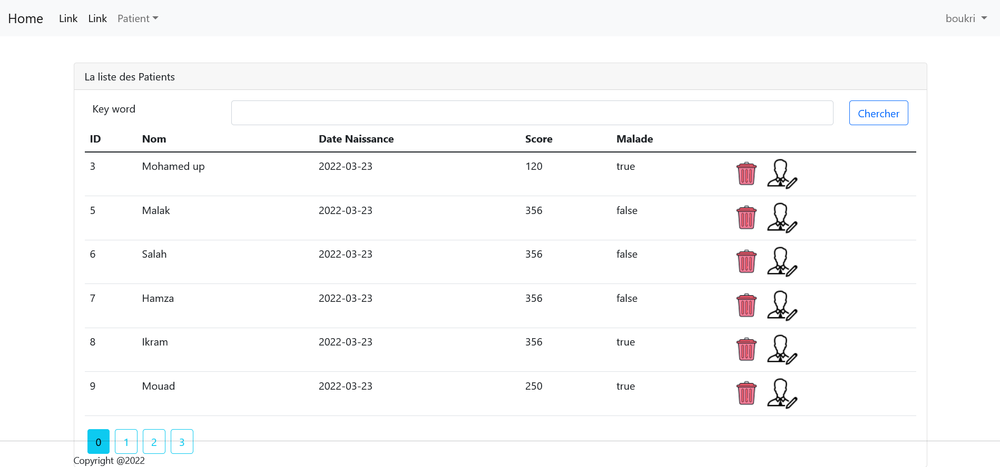
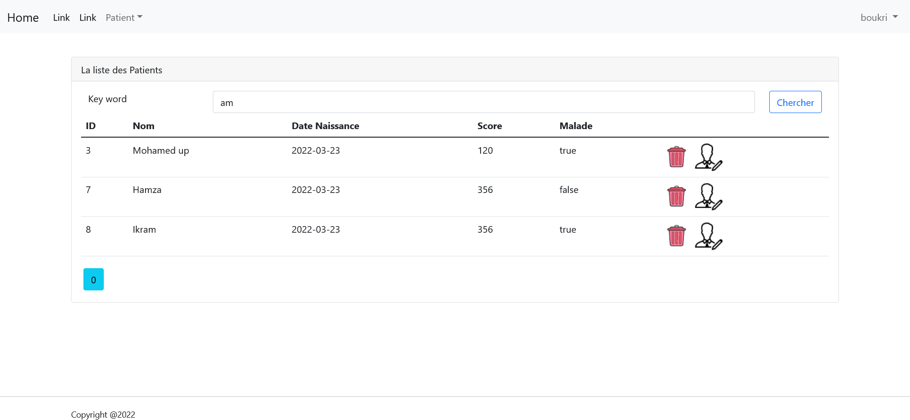
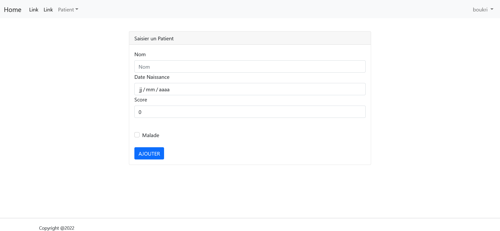
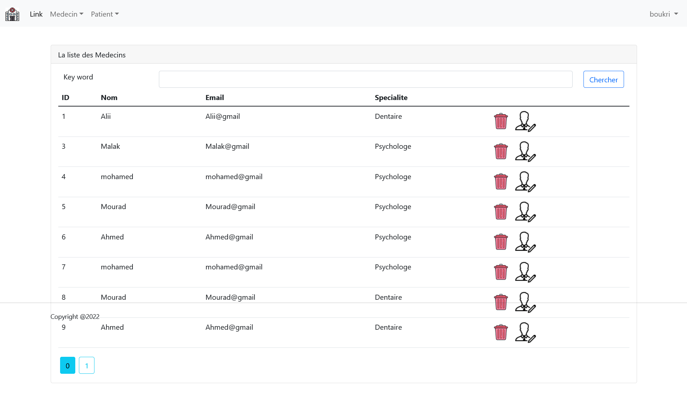
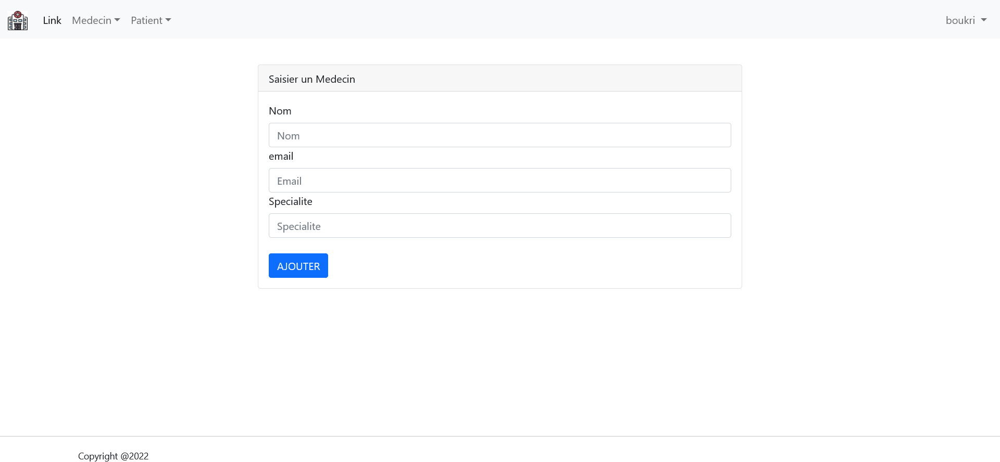
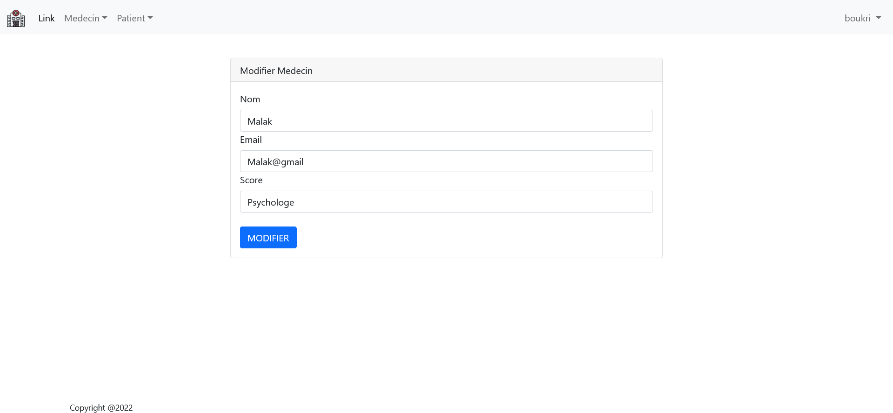
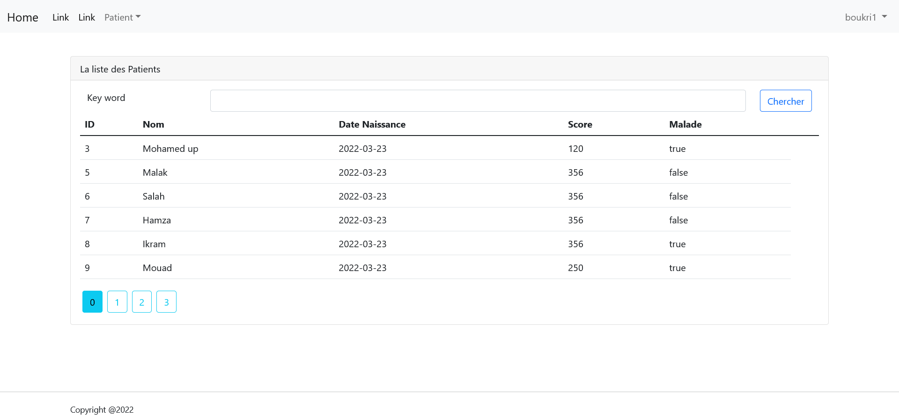
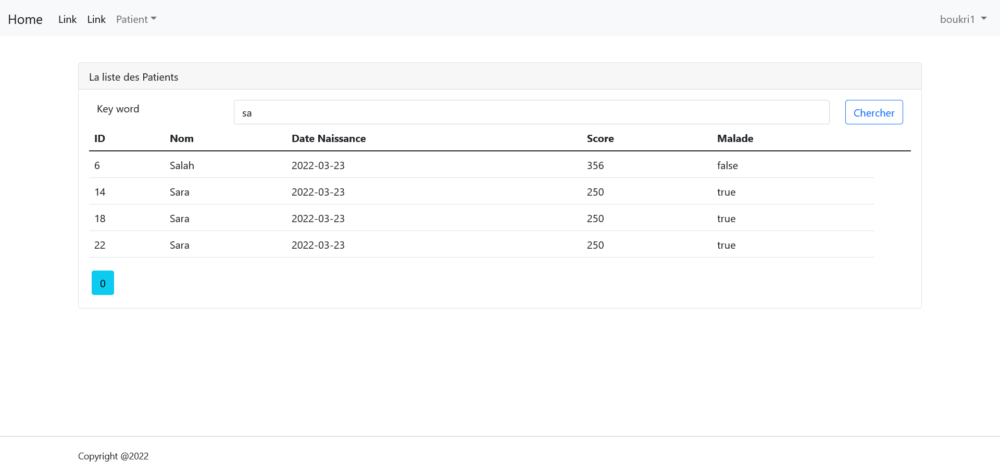

<h2><u>Compte Rendu</u></h2>
<h3>Application Web pour la gestion d'un hôpital à l'aide du  Spring Boot Spring MVC Thymeleaf Spring Securiry  </h3>

<ul>
<li style="color: red"><strong>ADMINISTRATEUR</strong>
    

<h3>Patient</h3>
    <ol> </ol>
    <ol style="text-align: center"><strong style="color: red">Figure 1: </strong> La liste des Patients</ol>
    <ol> </ol>
    <ol style="text-align: center"><strong style="color: red">Figure 2: </strong>Chercher un Patient</ol>
    <ol> </ol>
    <ol style="text-align: center"><strong style="color: red">Figure 3: </strong>Ajouter un Patient</ol>
     <ol> </ol>
    <ol style="text-align: center"><strong style="color: red">Figure 4: </strong>Modifier un Patient</ol>
<h3>Medecin</h3>
<ol> </ol>
    <ol style="text-align: center"><strong style="color: red">Figure 5: </strong>La liste des medecins</ol>
<ol> </ol>
    <ol style="text-align: center"><strong style="color: red">Figure 6: </strong>Ajouter un Medecin</ol>
<ol> </ol>
    <ol style="text-align: center"><strong style="color: red">Figure 7: </strong>Modifier un Medecin</ol>
</li>
<li style="color: red"><strong>UTILISATEUR</strong>
    

     <ol> </ol>
    <ol style="text-align: center"><strong style="color: red">Figure 1: </strong> La liste des Patients</ol>
 <ol> </ol>
    <ol style="text-align: center"><strong style="color: red">Figure 2: </strong> Chercher un Patient</ol>
<ol> </ol>
    <ol style="text-align: center"><strong style="color: red">Figure 3: </strong> Chercher un Patient</ol>
</li>    

</ul>

